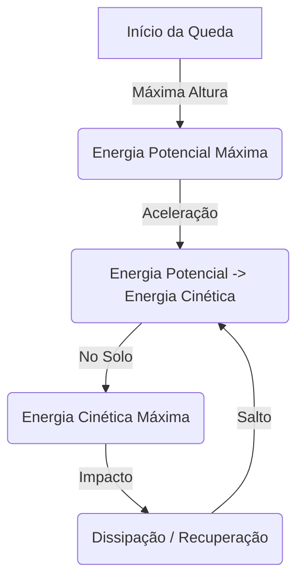

# FísicaSim - Simulador de Energia Mecânica 🎾

Um simulador interativo projetado para visualizar a conversão entre as energias cinética e potencial gravitacional em tempo real.

## 🚀 Como Funciona

Este simulador aplica as leis da física clássica para calcular as mudanças de estado energético de um objeto em queda livre:

### ⚡ Energia Potencial Gravitacional ($E_p$)
Representa a energia armazenada em função da altura e massa do objeto.
$$E_p = m \cdot g \cdot h$$
onde:
- $m$: Massa (kg)
- $g$: Gravidade (m/s²)
- $h$: Altura (m)

### 🔥 Energia Cinética ($E_k$)
Representa a energia do objeto em movimento.
$$E_k = \frac{1}{2} \cdot m \cdot v^2$$
onde:
- $m$: Massa (kg)
- $v$: Velocidade (m/s)

### 🔄 Conversão de Energia
Em um sistema conservativo (sem atrito), a Energia Total permanece constante:
$$E_{total} = E_p + E_k$$

## 🛠️ Tecnologias Utilizadas
- **HTML5 Semantic**: Para SEO e acessibilidade.
- **Vanilla CSS**: Design moderno com glassmorphism e animações.
- **Canvas API**: Renderização de física em tempo real via JavaScript.
- **GitHub Actions**: Deployment automatizado para GitHub Pages.

## ⚙️ Funcionalidades
- **Arrastar e Soltar**: Interaja diretamente com a esfera.
- **Ajustes em Tempo Real**: Altere massa, gravidade e atrito enquanto a simulação roda.
- **Visualização Estatística**: Barras de energia que se atualizam cada frame.
- **Simulação de Colisão**: A esfera quica e perde energia em cada impacto.

---
Desenvolvido por **Antigravity AI**
